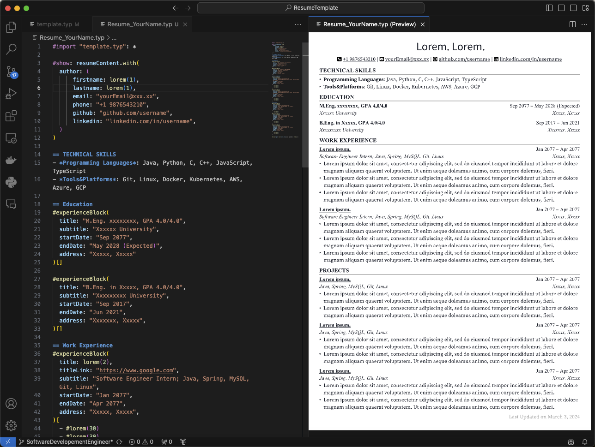

# A resume template for Software Developer written in Typst

## Usage

Approach 1:
1. Clone the repository
2. Use VSCode to open the project
3. Install the Typst preview extension and Typst LSP extension
- Typst preview extension: used to preview the resume in real-time
- Typst LSP extension: used to generate the resume in PDF format
4. Open the `Resume_YourName.typ` file

Approach 2:
1. Clone the repository
2. Upload the project to `Typst.app` which is a web-based editor for Typst

Here is the preview of the resume and edit view:

---

Please feel free to use the template and modify it as per your needs. If you have any suggestions or feedback, please feel free to reach out to me. 

And if you like the template, please give it a star.

